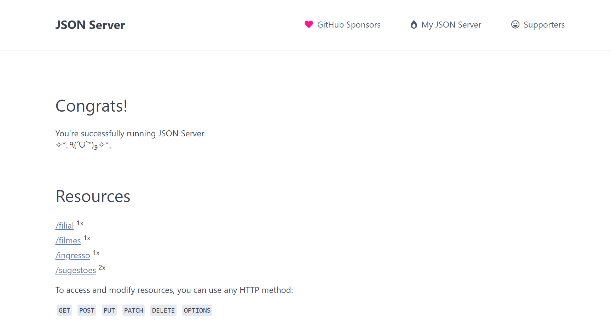

# Terceiro Projeto Individual - Lado C - Json Server
O objetivo do trabalho era o entendimento de como funciona um Json server e também a utilização da ferramenta Nodejs.

O serviço pode ser acessado pelo link: https://ladocjson.onrender.com

## Endpoints
<ol>
<li> /filmes </li>
<li> /filial </li>
<li> /ingressos </li>
</ol>

## Métodos
Podem ser utilizados os seguintes métodos em todas as rotas
<ol>
<li> GET </li>
<li> PUT </li>
<li> POST </li>
<li> PATCH </li>
<li> DELETE </li>
<li> OPTIONS </li>
</ol>

## Dependências utilizadas
- Express;
- Json Server;
- Node Fetch.

 
